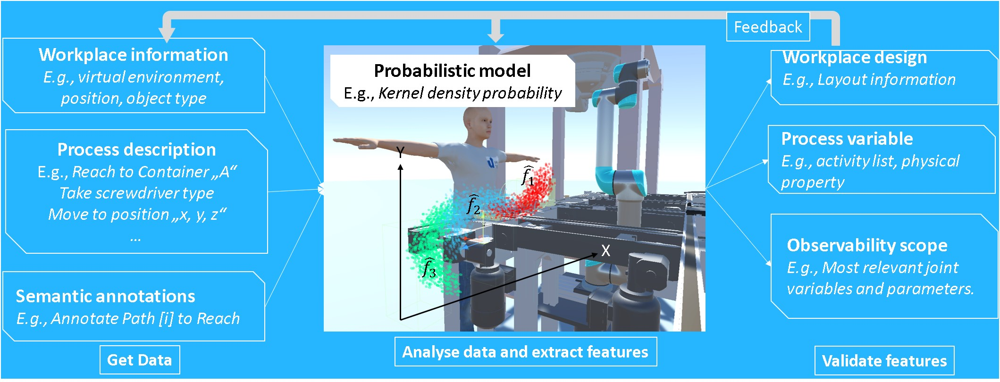

# 2023 in short  

+ **Journal article**  Our article entitled as "Explainable human activity recognition based on probabilistic spatial partitions for 
symbiotic workplaces" was published on the 'International Journal of Computer Integrated Manufacturing' (Impact factor 4.1 (2022), 23% 
acceptance rate). Link [here](https://doi.org/10.1080/0951192X.2023.2177742).

  

+ **Conference article** Our article entitled as "A Motion Capture-Based Approach to Human Work Analysis for Industrial Assembly Workstations" was presented at CARV/MCPC 2023 at University of Bologna, Italy and the paper was recognized for the Best Young Fellow Paper Award. 

+ **Tadele Belay Tuli** was elected to the grade of Senior Member level in the IEEE and participates in [Factory automation technical committee](https://tcfa.ieee-ies.org/members.html) and [Robotics](https://www.ieee-ras.org/). 
