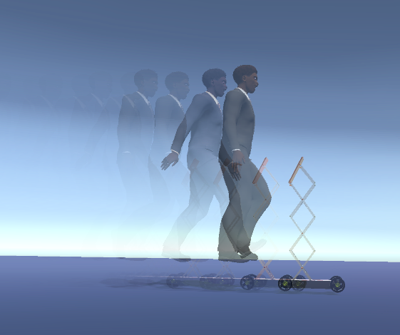

Adjustable, mobile and interactable robots, nowadays are useful to assist human beings for some social interactions. One example could be telepresence in pandemic crisis such as COVID-19.
However, human-robot physical interactions are still challenging regarding maneuverability, controllability, stability, drive layout, and autonomy.
Hence, this project presents a systematic design and control approach based on the customer's needs and expectations of telepresence mobile robots for social interactions.
A system model and controller design are developed using the Lagrangian method and linear quadratic regulator (LQR), respectively, for different scenarios such as flat surface, inclined surface, and yaw (steering).
The robot system is capable of traveling uphill (30deg) and has a variable height (600-1200 mm).
The robot is advantageous in developing countries to fill the skill gaps as well as for sharing knowledge and expertise using a virtual and mobile physical presence .

References
----------



[BACK TO HOME](../index.html)
