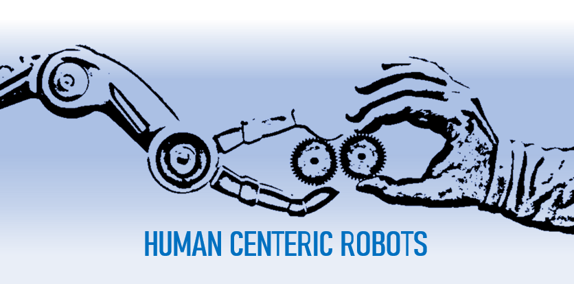
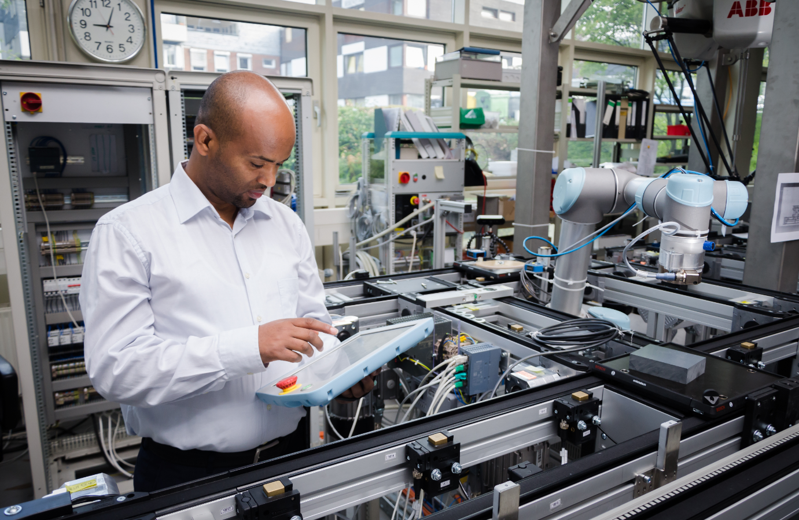

Humans have been at distant from a robot space for decades. However, it is shown that robots alone are not efficient. Therefore, I am researching methods to understand how humans and robots exist in harmony and collaborate, to reverse humans to robot workplace. In , methods that employ human motion behavior, ontology of human-robot collaboration and AI based data modeling are presented.This investigation has been further elaborated regarding the human activity identification and intention prediction 

Details of projects I am involved are available in Home posts;

